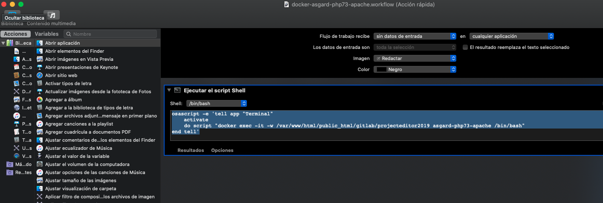

/change to home root
cd

// set default prompt
vi .bashrc

and at the end of content .bashrc

---

PS1="\u\$ "

---

Salir del terminal, y volver a entrar, ahora ya tienes tu prompt modificado (Y)

o puedes poner por defecto el nombre del proyecto así:
---
PS1="projecteditor2019$ "
---

Recuerda que estás lanzando el terminal usando el teclado command + shif + ,    y desde el programa automator, y que automator está lanzando este script: cuyos parametros setean por defecto el directorio -w /var/www/html/public_html/gitlab/projecteditor2019

Shell: /bin/bash
---
osascript -e 'tell app "Terminal"
activate
    do script "docker exec -it -w /var/www/html/public_html/gitlab/projecteditor2019 asgard-php73-apache /bin/bash"
end tell'
---

adjunto captura:
---

